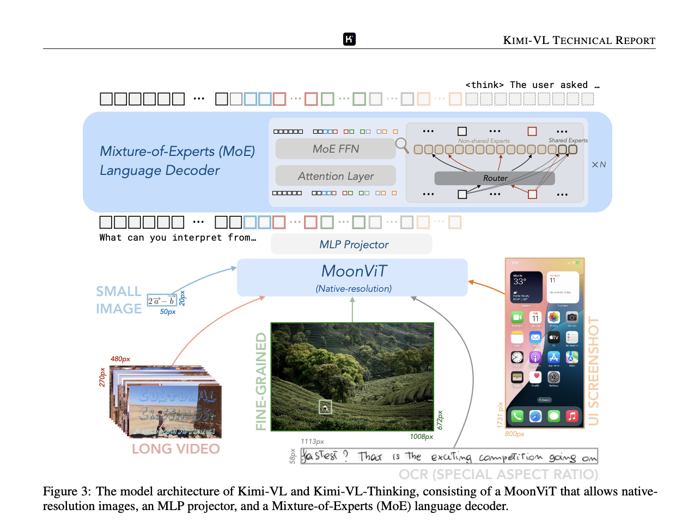
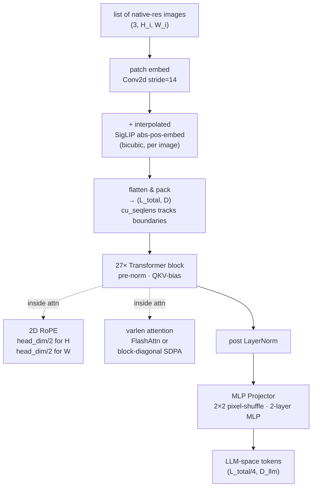

## MoonViT - Pytorch



<p align="left">
  <a href="https://pypi.org/project/open-moonvit/" target="_blank">
    <picture>
      <source srcset="https://img.shields.io/pypi/v/open-moonvit?style=for-the-badge&color=3670A0" media="(prefers-color-scheme: dark)">
      
    </picture>
  </a>
  <a href="https://twitter.com/kyegomezb/">
    <picture>
      <source srcset="https://img.shields.io/badge/Twitter-Follow-1DA1F2?style=for-the-badge&logo=twitter&logoColor=white" media="(prefers-color-scheme: dark)">
      
    </picture>
  </a>
  <a href="https://discord.gg/3keGBK9Pvr" target="_blank">
    <picture>
      <source srcset="https://img.shields.io/badge/Discord-Join-5865F2?style=for-the-badge&logo=discord&logoColor=white" media="(prefers-color-scheme: dark)">
      
    </picture>
  </a>
  <a href="https://pytorch.org" target="_blank">
    <picture>
      <source srcset="https://img.shields.io/badge/PyTorch-Implemented-EE4C2C?style=for-the-badge&logo=pytorch&logoColor=white" media="(prefers-color-scheme: dark)">
      
    </picture>
  </a>
</p>

This is an ultra-simple, single-file PyTorch implementation of <a href="https://arxiv.org/abs/2504.07491">MoonViT</a>, the native-resolution vision encoder from Kimi-VL. I implemented this model because I think it's a great ViT variation with the ability to ingest images of dynamic sizes and resolutions at scale.

## Install

```bash
$ git clone https://github.com/kyegomez/open-moonvit
$ cd open-moonvit
$ pip install torch
```

FlashAttention is optional. If `flash_attn` is importable and you're on CUDA, the var-length kernel is used automatically. Otherwise a block-diagonal SDPA fallback runs on CPU / MPS / CUDA with no extra dependencies.

```bash
$ pip install flash-attn --no-build-isolation  # optional
```

## Usage

```python
import torch
from main import MoonViT, MoonViTConfig, MLPProjector

encoder = MoonViT(MoonViTConfig())    # ~413M params, SigLIP-SO-400M defaults

# a batch of images at different resolutions, no padding, no resizing
images = [
    torch.randn(3, 224, 280),
    torch.randn(3, 140, 196),
    torch.randn(3, 336, 336),
]

out = encoder(images)
out.last_hidden_state    # (L_total, 1152)   packed patch tokens
out.cu_seqlens           # (4,) int32        image boundaries in the packed seq
out.grid_shapes          # [(16,20), (10,14), (24,24)]
```

To feed an LLM, compose with the MLP projector (2×2 pixel-shuffle then a two-layer MLP):

```python
projector = MLPProjector(
    vision_hidden_size = 1152,
    llm_hidden_size    = 2048,
)

tokens, grids, cu = projector(out.last_hidden_state, out.grid_shapes, out.cu_seqlens)
tokens.shape   # (L_total // 4, 2048)
```

## How it works



Four things to internalize:

1. **Packing, not padding.** Images of different shapes become one long sequence. No wasted compute on pad tokens.
2. **Two positional embeddings, added together.** The paper is insistent on this. Interpolated SigLIP absolute pos embed preserves the pretrained prior; 2D RoPE supplies the fine-grained, resolution-robust signal.
3. **Varlen attention is what makes (1) safe.** `cu_seqlens` slices the packed sequence so image *i* only attends to itself. FlashAttention does this in one kernel; the fallback loops per-image over SDPA.
4. **The projector lives outside the encoder.** Pixel shuffle is a 2×2 space-to-depth: four tokens become one, channels 4×. Then a plain two-layer MLP projects into LLM space.

## Citations

```bibtex
@article{kimivl2025,
    title   = {Kimi-VL Technical Report},
    author  = {{Kimi Team}},
    journal = {arXiv preprint arXiv:2504.07491},
    year    = {2025},
    url     = {https://arxiv.org/abs/2504.07491}
}
```

```bibtex
@article{dehghani2023navit,
    title   = {Patch n' Pack: NaViT, a Vision Transformer for any Aspect Ratio and Resolution},
    author  = {Dehghani, Mostafa and Mustafa, Basil and Djolonga, Josip and Heek, Jonathan and Minderer, Matthias and Caron, Mathilde and Steiner, Andreas and Puigcerver, Joan and Geirhos, Robert and Alabdulmohsin, Ibrahim and Oliver, Avital and Padlewski, Piotr and Gritsenko, Alexey and Lucic, Mario and Houlsby, Neil},
    journal = {arXiv preprint arXiv:2307.06304},
    year    = {2023}
}
```

```bibtex
@article{zhai2023siglip,
    title   = {Sigmoid Loss for Language Image Pre-Training},
    author  = {Zhai, Xiaohua and Mustafa, Basil and Kolesnikov, Alexander and Beyer, Lucas},
    journal = {arXiv preprint arXiv:2303.15343},
    year    = {2023}
}
```

```bibtex
@article{su2021roformer,
    title   = {RoFormer: Enhanced Transformer with Rotary Position Embedding},
    author  = {Su, Jianlin and Lu, Yu and Pan, Shengfeng and Murtadha, Ahmed and Wen, Bo and Liu, Yunfeng},
    journal = {arXiv preprint arXiv:2104.09864},
    year    = {2021}
}
```

# License

APACHE License 2.0